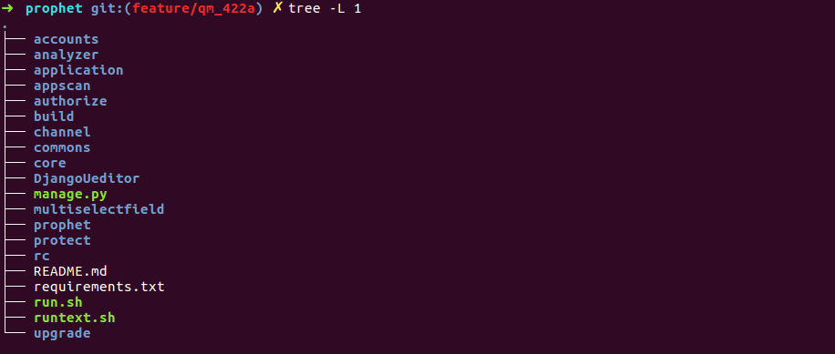

[toc!]

欢迎来到 **{先知}(prophet)** 平台
### 内容介绍

 - 工作原理
 - stub
 - 项目结构
 - 模块说明
 - api相关
#### 工作原理
prophet 服务器是用Django开发的web_api服务器,主要负责数据接受,存储,转发任务.

如图所示 prophet在接受到前段web发送的请求后会用各个模块的stub函数进行整理,然后发送给调度
服务器,再去各个微服务上拿数据,最后返回数据

#### stub
各个微服务的统一结构体方法
#### 项目结构

 - 模块说明

